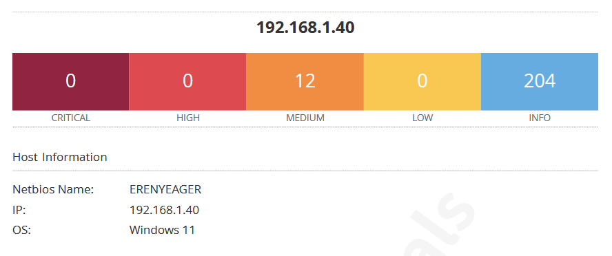

# Task 3: Basic Vulnerability Scan Report

**Scan Target:** 192.168.1.40  
**Host Name:** ERENYEAGER (Windows 11)  
**Tool Used:** Nessus Essentials  
**Scan Policy:** Basic Network Scan  
**Date of Scan:** 26 Sep 2025  
**Scan Duration:** 3085 sec (≈51 min)

---

## 1. Scan Summary

| Severity | Count |
|----------|-------|
| Critical | 0     |
| High     | 0     |
| Medium   | 12    |
| Low      | 0     |
| Info     | 204   |
| **Total**| 216   |

---

## 2. Medium Severity Vulnerabilities (List Only)

- **SMB Signing Not Required (Plugin 57608)** – SMB traffic not signed, vulnerable to MITM attacks. *Fix: Enable “Microsoft network server: Digitally sign communications (always)” policy in Windows.*  
- **SSL Certificate Cannot Be Trusted (Plugin 51192)** – Server uses self-signed or untrusted certificates across multiple ports. *Fix: Replace with certificates from a trusted Certificate Authority.*  
- **SSL Certificate Expiry (Plugin 15901)** – Expired certificate detected on tcp/9012. *Fix: Purchase or generate a new certificate to replace the expired one.*  
- **SSL Certificate with Wrong Hostname (Plugin 45411)** – Certificate common name does not match host. *Fix: Issue new certificates with correct hostnames.*  
- **SSL Self-Signed Certificate (Plugin 57582)** – Self-signed certificates detected on Splunk, WebSocket++ and Lenovo services. *Fix: Replace self-signed certificates with CA-signed certificates.*

---

## 3. Informational Findings (Highlights)

- Open ports detected: 135/tcp, 445/cifs, 8089/www, 8834/www, 9012/www, 59757/www; UDP 53, 123, 137, 138.  
- SMB information disclosure (NTLMSSP and NativeLanManager reveal system name/domain).  
- Multiple DCE/RPC services enumerated on dynamic ports (49664–49699).  
- Web servers detected: Splunkd, WebSocket++/0.8.2, NessusWWW.  
- HTTPS servers not enforcing HSTS (tcp/9012 and tcp/59757).  

---

## 4. Conclusion

- No Critical or High vulnerabilities detected, but **12 Medium vulnerabilities** present.  
- **Most issues** relate to untrusted/expired/self-signed SSL certificates and SMB signing not required.  
- **Recommended actions:**  
  - Replace or reissue SSL certificates with valid CA-signed ones.  
  - Enable SMB signing in Windows Group Policy.  
  - Review and restrict unnecessary open services.  

---

**Prepared by:** Glen Dsouza
